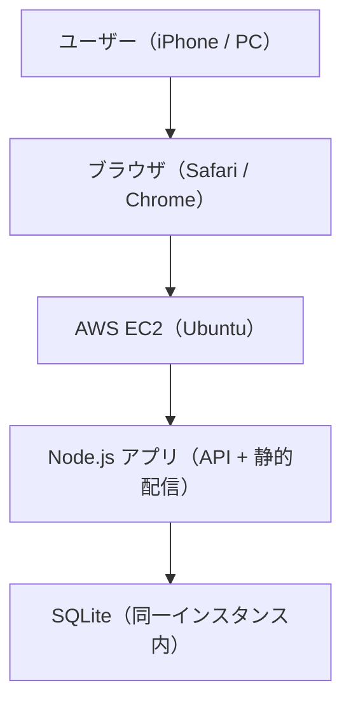

# README

このファイルは「このプロジェクトの説明書」です。  
初めて開いた人が迷わないように、使い方や構成をまとめます。

## package.json の説明（初心者向け）

`package.json` は **Node.jsプロジェクトの設定ファイル** です。  
ここには「アプリ名」「使うライブラリ」「起動方法」などが書かれています。

### 1. name / version / description
- **name**: プロジェクト名  
- **version**: バージョン番号  
- **description**: どんなアプリか一言説明

### 2. main
- **main** は「起点になるファイル名」  
  今回は `server.js` が入口です。

### 3. scripts
- **scripts** は「短いコマンドの登録」  
  例:  
  `npm start` → `node server.js` を実行する

### 4. dependencies
- **dependencies** は「アプリで使うライブラリ一覧」

今回の意味:
- `express`：Webサーバーを作る  
- `cors`：別ドメインからのアクセス許可  
- `bcryptjs`：パスワードの安全な保存  
- `jsonwebtoken`：ログイン用トークン（JWT）作成  
- `sqlite` / `sqlite3`：データベース

---

## よく使うコマンド

```bash
# 依存ライブラリをインストール
npm install

# サーバーを起動
npm start
```

---

## 構成図（AWS EC2 前提）



### 役割のざっくり説明
- **ブラウザ**: 画面表示と操作  
- **EC2**: サーバーを置く場所（公開用）  
- **Node.js**: アプリの処理・API  
- **SQLite**: データ保存（同じサーバー内）  
