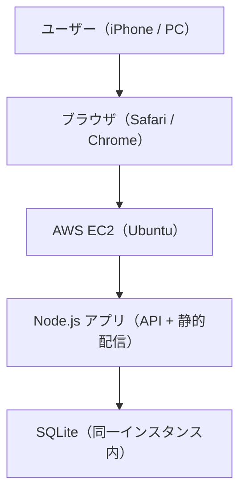

# README

このファイルは「このプロジェクトの説明書」です。  
初めて開いた人が迷わないように、使い方や構成をまとめます。

## package.json の説明（初心者向け）

`package.json` は **Node.jsプロジェクトの設定ファイル** です。  
ここには「アプリ名」「使うライブラリ」「起動方法」などが書かれています。

### 1. name / version / description
- **name**: プロジェクト名  
- **version**: バージョン番号  
- **description**: どんなアプリか一言説明

### 2. main
- **main** は「起点になるファイル名」  
  今回は `server.js` が入口です。

### 3. scripts
- **scripts** は「短いコマンドの登録」  
  例:  
  `npm start` → `node server.js` を実行する

### 4. dependencies
- **dependencies** は「アプリで使うライブラリ一覧」

今回の意味:
- `express`：Webサーバーを作る  
- `cors`：別ドメインからのアクセス許可  
- `bcryptjs`：パスワードの安全な保存  
- `jsonwebtoken`：ログイン用トークン（JWT）作成  
- `sqlite` / `sqlite3`：データベース

---

## よく使うコマンド

```bash
# 依存ライブラリをインストール
npm install

# サーバーを起動
npm start
```

---

## 構成図（AWS EC2 前提）



### 役割のざっくり説明
- **ブラウザ**: 画面表示と操作  
- **EC2**: サーバーを置く場所（公開用）  
- **Node.js**: アプリの処理・API  
- **SQLite**: データ保存（同じサーバー内）

---

## 実務向けの最低限運用メモ

### 1. デプロイ手順（ローカル → EC2）
ローカルの変更をEC2に反映する一番シンプルな方法です。

```bash
# ローカルで実行（Mac）
rsync -av -e "ssh -i /Users/ytaro1206/Downloads/wages-key.pem" \
  --exclude node_modules --exclude .git --exclude '*.db' --exclude '*.db-*' \
  /Users/ytaro1206/Wages-Table/ \
  ubuntu@<EC2のパブリックIP>:~/wages-table/
```

```bash
# EC2で実行（アプリ再起動）
cd ~/wages-table
pm2 restart wages-app
```

補足:
- SQLite 本体は `/home/ubuntu/wages-data/app.db` を使う
- デプロイ時に `.db` を同期しない（ローカルDBで本番DBを上書きしないため）

### 2. バックアップ（最低限）
SQLiteはファイルなので、DBファイルをコピーすればOKです。

```bash
# EC2で実行（バックアップ）
cp /home/ubuntu/wages-data/app.db /home/ubuntu/wages-data/app.db.bak
```

### 3. リストア（最低限）
バックアップから戻す場合は、停止→差し替え→再起動。

```bash
# EC2で実行（リストア）
pm2 stop wages-app
cp /home/ubuntu/wages-data/app.db.bak /home/ubuntu/wages-data/app.db
pm2 start wages-app
```

### 4. 監視（最低限）
死活確認はまず `pm2` と `curl` で確認します。

```bash
# EC2で実行（起動状態の確認）
pm2 list
```

```bash
# EC2で実行（HTTP応答チェック）
curl -I http://127.0.0.1:8000
```

### 5. 最低限の安全対策（運用メモ）
- HTTPS化（Let’s Encrypt）
- `JWT_SECRET` を強い値にする
- ID/パスワードを強化
- SSHの接続元IPを自分のIPだけに制限

---

## 運用ログ（メモ）

### 2026-03-18
- HTTPS化完了（Let’s Encrypt）
  - 対象ドメイン: `ytworksapp.com`, `app.ytworksapp.com`
  - 証明書: `/etc/letsencrypt/live/ytworksapp.com/`
  - Nginx: `/etc/nginx/sites-available/wages` / `/etc/nginx/sites-enabled/wages`
  - 更新: certbot の自動更新を有効化済み
